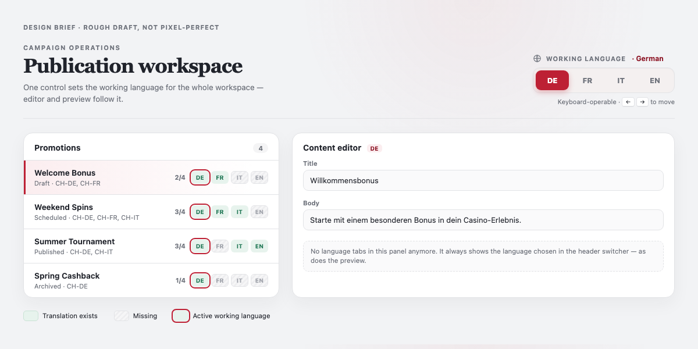

# Frontend Assessment: Promotion CMS — Working Language Switcher

**Duration:** 60 minutes
**Technology:** React, TypeScript, CSS, existing test framework
**Tools:** Use whatever tools you'd normally use for this kind of work.

**Goal:** Turn the language selection that is currently buried inside the
editor into a single, visible, global control, and surface each promotion's
translation coverage in the list.

## Business context

PromoOps is an internal CMS used by content editors to prepare multilingual
online-casino promotions. Editors browse and filter promotions, select a
language, edit translated content, preview a promotion, and prepare it for
publication.

You are joining an unfamiliar existing project. Do not rebuild the
application or replace its framework. Work within the existing dependencies
(React, TypeScript, CSS, React Router) and do not replace the mocked API
with static data.

## How it works today

There are four content locales: German (`de`), French (`fr`), Italian
(`it`), and English (`en`).

The active language already lives as shared state in `PromotionsWorkspace`
and drives both the Content Editor and the Preview. The only control that
changes it is a row of language tabs **inside** the Content Editor panel.
There is no single, obvious place that tells an editor which language they
are working in, or which promotions are missing translations.

`PublicationReadiness` also exists but is unfinished — completing it is an
optional bonus (see below), not part of the core task.

## Task

Promote the buried language selection to a single, visible, global control,
and make translation coverage visible at a glance in the list.



The screenshot is a rough draft, not a pixel-perfect spec. Match its intent,
not its exact spacing or colours — use the existing design system. It shows a
single working-language switcher in the header, per-locale coverage on each
list row, and an editor and preview that follow the header switcher with no
language control of their own.

Concretely:

1. **Move the language control to the header.** Add a working-language
   switcher in the workspace header and remove the language tabs from the
   Content Editor. After this, the header switcher is the only place the
   language is chosen.
2. **Preserve the existing sync.** The editor and preview are already driven
   by one shared language value — keep it that way. Changing the header
   switcher must update both. Do not introduce a second, independent
   selection or duplicate the language state.
3. **Show coverage in the list.** For each promotion, show which of the four
   locales have a translation and which are missing, and visually
   distinguish the currently active language among them.
4. **Keep the language stable across promotions.** Selecting a different
   promotion must not reset the active language.
5. **Keep it accessible.** The switcher must be keyboard-operable with clear
   labels. The active language and the missing-translation state must not be
   conveyed by colour alone.

### Required test

Add at least one deterministic behavioural test that:

- Changes the language in the new header switcher and asserts that **both**
  the Content Editor's shown translation and the Preview's requested locale
  update accordingly.
- Asserts that a promotion missing a translation for some locale is shown as
  missing in the list.

Do not depend on real network timing. A test that only checks that rendering
returned a container is insufficient.

## If you finish early (bonus)

Attempt these **only** after the switcher and its test are complete and
verified. They are bonuses — do not sacrifice the core task to reach them.
If you tackle both, do them in this order.

### Bonus 1 — Complete publication readiness

Complete `PublicationReadiness`. German is always required. Markets add these
requirements:

| Market  | Required language |
| ------- | ----------------- |
| `CH-DE` | German (`de`)     |
| `CH-FR` | French (`fr`)     |
| `CH-IT` | Italian (`it`)    |

Rules:

- Validate each required language once. Title, body, CTA label, and CTA URL
  must be present; whitespace-only values are invalid. CTA URLs must be
  valid, absolute HTTPS URLs.
- The schedule is valid only when both dates are valid and the end is later
  than the start. The start need not be in the future.
- A preview fallback does not satisfy validation for a missing translation.

The panel must:

- Show **Ready to publish** or **Not ready to publish**.
- Give specific blocking reasons, grouped by language or schedule.
- Distinguish blocking errors from optional-language warnings.
- Disable Publish while any blocking error exists.
- Update immediately as content changes.

### Bonus 2 — Fix the preview timing defect

The preview can briefly show stale content during rapid promotion/language
switching on slow connections: after the requests settle, it may show the
previously selected promotion or language instead of the current one. You may
notice this while testing rapid switching in the core task — that's expected.
Don't stop to fix it there; leave it for this bonus if you have time.

## Suggested working flow

Guidance, not fixed cut-offs. You may rebalance time, provided the final
submission is ready at the agreed end.

**1. Orient (~10 min).** Run the app, review the design brief, and read
`PromotionsWorkspace`, `PromotionEditor`, `PromotionList`, and
`PromotionPreview`. Jot a short `APPROACH.md` (≤150 words):

```md
## Current implementation
## Planned component and state changes
## Files likely to change
## Verification plan
```

**2. Build (~35 min).** Implement the switcher, remove the editor tabs, add
the list coverage indicators, and write the required test. This is the bulk
of the exercise.

**3. Verify and hand over (~10–15 min).** Run the tests and the build,
review your diff, remove debug code, and write `HANDOVER.md` (≤150 words)
for an application manager or Support lead: what changed, how you verified
it, any deliberate deviations from the brief, and remaining risks.

## Priority

1. Header switcher correctly drives the editor and preview
2. A meaningful behavioural test for it
3. Per-promotion translation-coverage indicators
4. Keyboard operability and non-colour-only state
5. Handover
6. Bonuses, only if 1–5 are done — publication readiness, then the preview
   timing defect

A smaller verified implementation beats a larger unverified one.

## Post-assessment discussion (~10 min, separate from the timed window)

Two short verbal prompts, not hands-on:

1. **Extend it.** If you didn't reach the publication-readiness bonus, walk
   through how you'd implement and test it and what could go wrong. If you
   did, explain the trade-offs you made.
2. **Scale it up.** Assume PromoOps grows to 100 active editors, 50,000
   promotions, and multiple releases per week. Name the one change you'd
   prioritise across performance, reliability, or architecture, and why.

The optional high-volume scenario (`npm run dev:performance`) may be used as
supporting evidence for prompt 2.

This discussion is evaluated separately and cannot compensate for failure of
the core switcher requirement.
